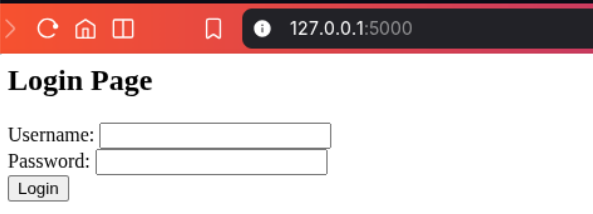
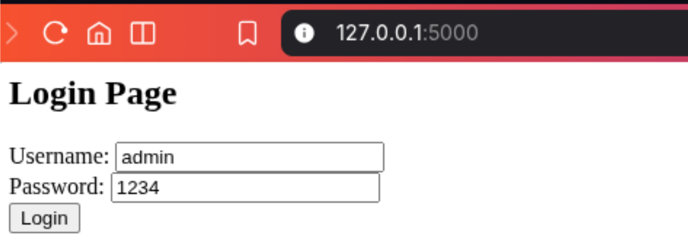
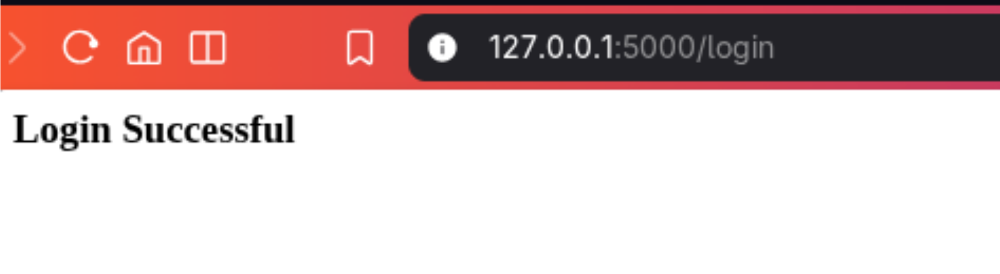
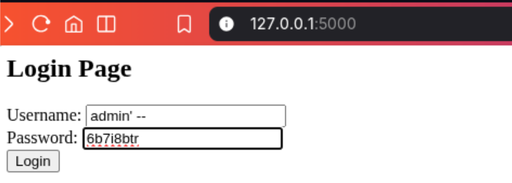
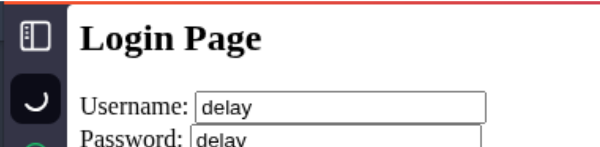
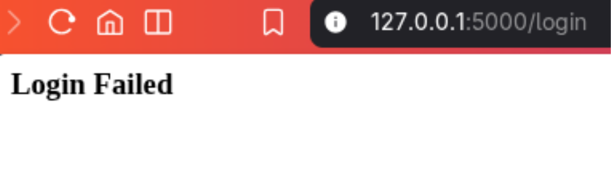

# 💉 SQL Injection Lab

## 📌 Project Overview

This project demonstrates the execution of a SQL Injection attack against a vulnerable Python Flask web application, as part of a university ethical hacking course lab. The vulnerable code was provided by the instructor; my work involved setting up the lab, running the application, performing authentication bypass attacks, testing boolean-based and time-based injections, and applying the fix to prevent the vulnerability.

The objective was to understand how SQL injection works, observe how input manipulates database queries, and learn secure coding practices.

---

## 🛠️ Environment & Tools

- Operating System: Kali Linux (Virtual Machine)
- Application: Python Flask with SQLite database
- Browser: Firefox (or any web browser)
- Editor: nano (for modifying code)
- Tools: Terminal, Web Browser

---

## 📋 Steps Performed

### 1. Lab Setup
- Created a dedicated folder:
  mkdir -p /sqli_lab
  cd /sqli_lab

- Created the vulnerable Python app (app.py) using the code provided by the instructor.

2. Running the Application

- Started the Flask server:
  python3 app.py
  
- Opened the login page at http://127.0.0.1:5000.
---

3. Normal Login Test

- Entered valid credentials:
  - Username: admin
  - Password: 1234
---

- ✔ Login successful (application works normally).
---

4. SQL Injection – Authentication Bypass

- Injected malicious input:
  - Username: admin' --
  - Password: anything
---

- Result: Login successful without a valid password!

Explanation:
The query became:

SELECT * FROM users WHERE username='admin' -- ' AND password='anything'

Everything after -- is treated as a comment, so the password condition is ignored.

5. Boolean-Based SQL Injection

- Tested TRUE/FALSE conditions:
  - admin' OR 1=1 -- → Login successful (TRUE)
  - blah' OR 1=2 -- → Login failed (FALSE)
    
- This demonstrates how attackers can infer information from application responses.

6. Time-Based SQL Injection (Simulation)

- Modified the app (as per instructor instructions) to include a delay based on input.
- Input delay caused the page to take ~5 seconds to respond, illustrating how time delays can be used to extract data without visible errors.
---

7. Fixing the Vulnerability

- Replaced the vulnerable query with a parameterized query (using ? placeholders) as instructed:
  SELECT * FROM users WHERE username=? AND password=?

- This prevents SQL injection by separating SQL code from user input.
---

---

📚 Skills Demonstrated

- Web Application Security Fundamentals
- SQL Injection exploitation (authentication bypass, boolean, time-based)
- Understanding of secure coding practices (parameterized queries)
- Basic Penetration Testing Methodology
- Linux Command Line Usage

---

⚠️ Ethical Disclaimer

This project was performed for educational purposes only. All testing was done on a local, self-contained environment. No real systems were targeted, and no unauthorized access was attempted.

---

📝 Note on Code

The code used in this lab (app.py) was provided by the course instructor as part of a university assignment. My contribution was executing the lab, performing attacks, analyzing results, and applying the security fix.
